# 🗺️ Mapa Técnico del Proyecto - CodeMio Backend

Este documento proporciona una visión técnica completa del proyecto utilizando diagramas Mermaid para visualizar arquitectura, flujos de trabajo y relaciones entre componentes.

---

## 📐 Arquitectura General del Sistema

```mermaid
graph TB
    subgraph "Cliente"
        FE[Frontend React + Vite]
    end
    
    subgraph "Backend - Django"
        API[API REST<br/>Django REST Framework]
        AUTH[Autenticación<br/>Sistema de Roles]
        PROJ[Gestión de<br/>Proyectos]
        FILE[Gestión de<br/>Archivos]
        ANAL[Servicio de<br/>Análisis]
        LINT[Java Lint<br/>Librería]
    end
    
    subgraph "Persistencia"
        DB[(MySQL<br/>Base de Datos)]
        MEDIA[Media Storage<br/>Archivos .java/.zip]
    end
    
    subgraph "Infraestructura"
        DOCKER[Docker<br/>Contenedorización]
        GHA[GitHub Actions<br/>CI/CD]
        RENDER[Render<br/>Hosting]
    end
    
    FE -->|HTTP/REST| API
    API --> AUTH
    API --> PROJ
    API --> FILE
    API --> ANAL
    ANAL --> LINT
    
    AUTH --> DB
    PROJ --> DB
    FILE --> DB
    FILE --> MEDIA
    ANAL --> DB
    
    DOCKER --> RENDER
    GHA --> DOCKER
    
    style FE fill:#61dafb
    style API fill:#092E20
    style DB fill:#316192
    style DOCKER fill:#2496ED
    style RENDER fill:#46E3B7
```

---

## 🔄 Flujo de Trabajo de Desarrollo

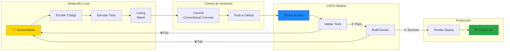

---

## 📊 Modelo de Datos (Entidad-Relación)

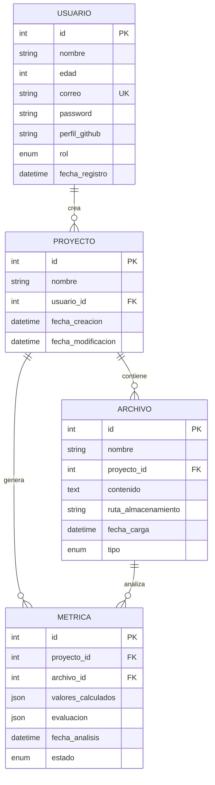

---

## 🔐 Flujo de Autenticación

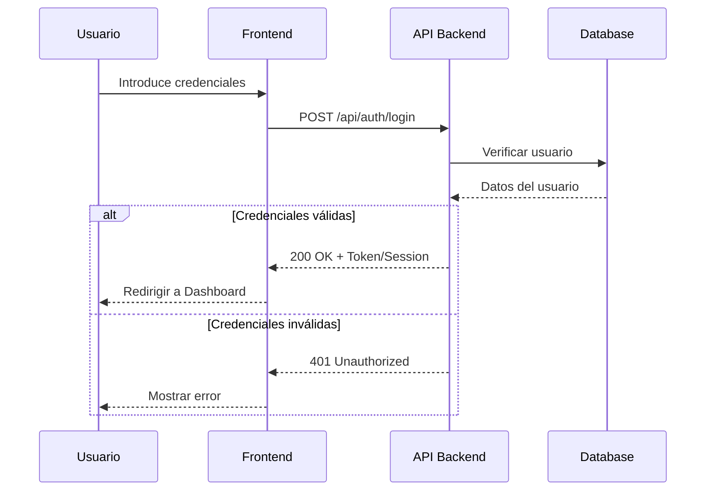

---

## 📤 Flujo de Carga y Análisis de Archivos

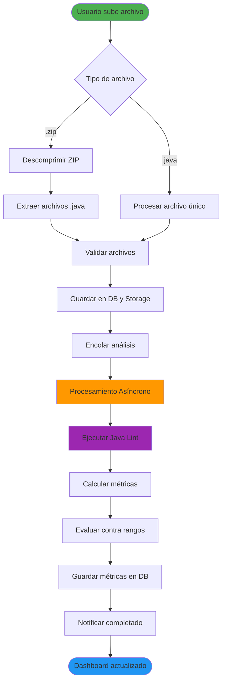

---

## 🏗️ Arquitectura de Directorios del Proyecto

```mermaid
graph TD
    ROOT[codemio_back/]
    
    ROOT --> CONFIG[codemio_back/<br/>Configuración Django]
    ROOT --> GITHUB[.github/<br/>CI/CD Workflows]
    ROOT --> DOCS[Documentación<br/>*.md]
    ROOT --> DOCKER[Docker<br/>Dockerfile, compose]
    ROOT --> CONF[Configuración<br/>.gitignore, .flake8]
    ROOT --> DEPS[requirements.txt<br/>Dependencias]
    ROOT --> MANAGE[manage.py<br/>CLI Django]
    
    CONFIG --> SETTINGS[settings.py]
    CONFIG --> URLS[urls.py]
    CONFIG --> WSGI[wsgi.py]
    
    GITHUB --> CI[ci.yml<br/>Pipeline CI/CD]
    
    DOCS --> README[README.md]
    DOCS --> COMMANDS[COMMANDS.md]
    DOCS --> SUMMARY[CONFIGURATION_SUMMARY.md]
    DOCS --> MAP[PROJECT_MAP.md]
    
    style ROOT fill:#092E20
    style CONFIG fill:#44B78B
    style DOCS fill:#2196F3
```

---

## 🔄 Pipeline de CI/CD

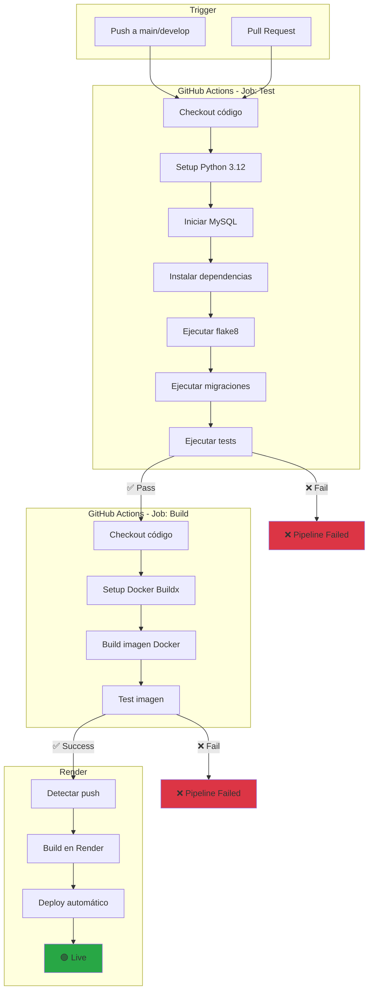

---

## 🎯 Flujo de Casos de Uso Principales

### Usuario Regular (USER)

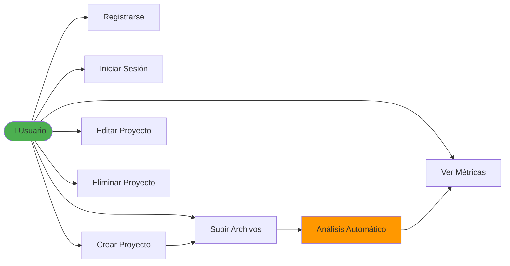

### Administrador (ADMIN)

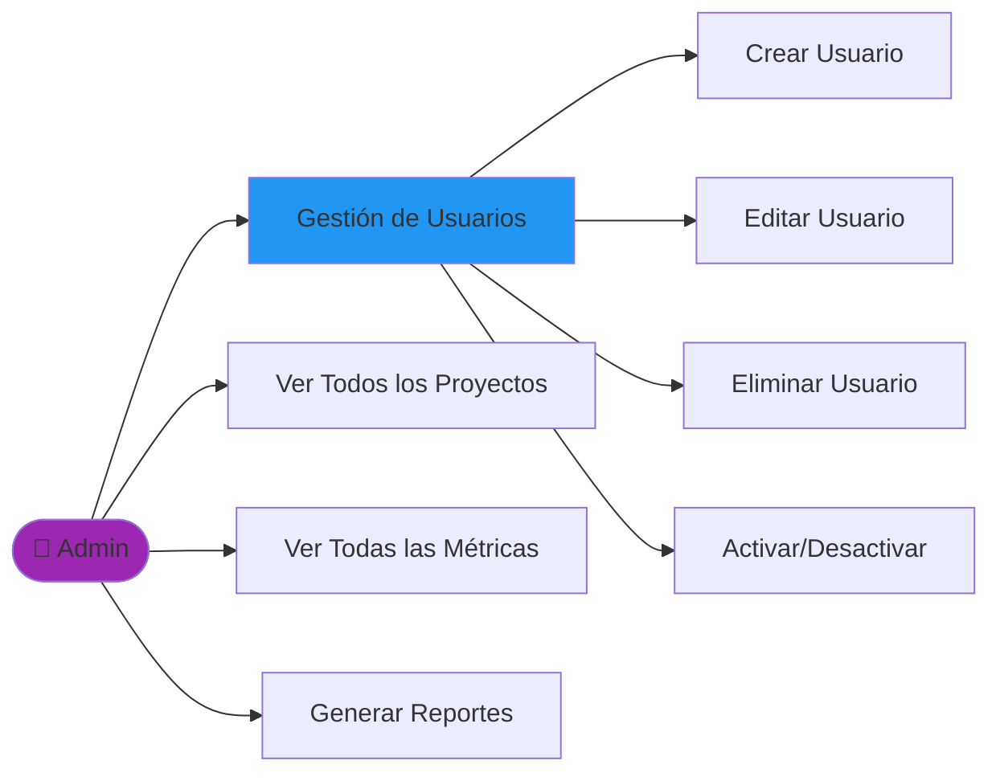

---

## 🌐 API REST - Estructura de Endpoints

```mermaid
graph TB
    ROOT[API Root<br/>/api/]
    
    ROOT --> AUTH[/auth/]
    ROOT --> USERS[/users/]
    ROOT --> PROJECTS[/projects/]
    ROOT --> FILES[/files/]
    ROOT --> METRICS[/metrics/]
    
    AUTH --> LOGIN[POST /login/]
    AUTH --> REGISTER[POST /register/]
    AUTH --> LOGOUT[POST /logout/]
    
    USERS --> LISTUSERS[GET /]
    USERS --> USERDETAIL[GET /:id/]
    USERS --> UPDATEUSER[PUT/PATCH /:id/]
    USERS --> DELETEUSER[DELETE /:id/]
    
    PROJECTS --> LISTPROJ[GET /]
    PROJECTS --> CREATEPROJ[POST /]
    PROJECTS --> PROJDETAIL[GET /:id/]
    PROJECTS --> UPDATEPROJ[PUT/PATCH /:id/]
    PROJECTS --> DELETEPROJ[DELETE /:id/]
    
    FILES --> UPLOADFILE[POST /upload/]
    FILES --> LISTFILES[GET /]
    FILES --> FILEDETAIL[GET /:id/]
    FILES --> DELETEFILE[DELETE /:id/]
    
    METRICS --> LISTMETRICS[GET /]
    METRICS --> METRICDETAIL[GET /:id/]
    METRICS --> PROJMETRICS[GET /project/:id/]
    
    style ROOT fill:#092E20
    style AUTH fill:#4CAF50
    style PROJECTS fill:#2196F3
    style FILES fill:#FF9800
    style METRICS fill:#9C27B0
```

---

## 🐳 Arquitectura Docker

```mermaid
graph TB
    subgraph "Docker Compose - Desarrollo Local"
        WEB[Web Service<br/>Django App<br/>:8000]
        DB[MySQL Service<br/>:3306]
        VOL[Volumen<br/>mysql_data]
    end
    
    subgraph "Dockerfile - Producción"
        BASE[Base: python:3.12-slim]
        DEPS[Instalar dependencias<br/>sistema y Python]
        COPY[Copiar código<br/>del proyecto]
        STATIC[Collectstatic]
        START[Script de inicio<br/>migrate + gunicorn]
    end
    
    WEB --> DB
    DB --> VOL
    
    BASE --> DEPS
    DEPS --> COPY
    COPY --> STATIC
    STATIC --> START
    
    style WEB fill:#092E20
    style DB fill:#316192
    style START fill:#499848
```

---

## 📦 Dependencias del Proyecto

```mermaid
graph LR
    subgraph "Core"
        DJANGO[Django 5.2.11]
        DRF[DRF 3.15.2]
    end
    
    subgraph "Base de Datos"
        PYMYSQL[PyMySQL]
        DBURL[dj-database-url]
    end
    
    subgraph "Servidor"
        GUNICORN[Gunicorn 22.0.0]
    end
    
    subgraph "Configuración"
        DECOUPLE[python-decouple]
        DOTENV[python-dotenv]
        ENVIRON[django-environ]
    end
    
    subgraph "Seguridad y CORS"
        CORS[django-cors-headers]
    end
    
    subgraph "Utilidades"
        PILLOW[Pillow]
    end
    
    DJANGO --> DRF
    DJANGO --> PYMYSQL
    DJANGO --> CORS
    DRF --> DJANGO
    
    style DJANGO fill:#092E20
    style DRF fill:#A30000
    style GUNICORN fill:#499848
```

---

## 🔄 Ciclo de Vida de una Solicitud HTTP

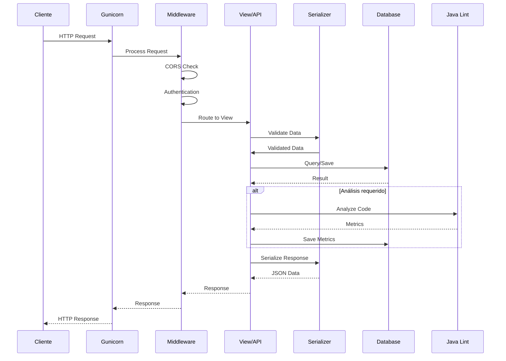

---

## 📝 Configuración de Variables de Entorno

```mermaid
graph TD
    ENV[.env File]
    
    ENV --> SECRET[SECRET_KEY<br/>Django Secret]
    ENV --> DEBUG[DEBUG<br/>True/False]
    ENV --> HOSTS[ALLOWED_HOSTS<br/>CSV List]
    ENV --> DBURL[DATABASE_URL<br/>MySQL URL]
    ENV --> CORS[CORS_ALLOWED_ORIGINS<br/>Frontend URLs]
    ENV --> PORT[PORT<br/>8000]
    
    SECRET --> DJANGO[Django App]
    DEBUG --> DJANGO
    HOSTS --> DJANGO
    DBURL --> MYSQL_DB[(MySQL)]
    CORS --> MIDDLEWARE[CORS Middleware]
    PORT --> GUNICORN[Gunicorn Server]
    
    style ENV fill:#FFC107
    style DJANGO fill:#092E20
    style MYSQL_DB fill:#4479A1
```

---

## 🔒 Sistema de Roles y Permisos

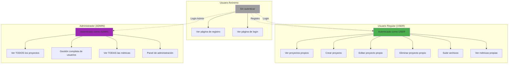

---

## 🎨 Recursos Estáticos y Media

```mermaid
graph TB
    subgraph "Desarrollo"
        STATIC_DEV[/static/<br/>CSS, JS, Images]
        MEDIA_DEV[/media/<br/>Uploaded Files]
    end
    
    subgraph "Producción"
        COLLECT[python manage.py<br/>collectstatic]
        STATICFILES[/staticfiles/<br/>Archivos estáticos<br/>recolectados]
        MEDIA_PROD[/media/<br/>Archivos subidos]
        
        COLLECT --> STATICFILES
    end
    
    subgraph "Servicio"
        NGINX[Servidor Web<br/>Render/Nginx]
        WHITENOISE[WhiteNoise<br/>Middleware]
    end
    
    STATICFILES --> WHITENOISE
    MEDIA_PROD --> NGINX
    WHITENOISE --> NGINX
    
    style COLLECT fill:#FF9800
    style NGINX fill:#009639
    style WHITENOISE fill:#2196F3
```

---

## 📚 Resumen de Documentación

| Diagrama | Descripción | Uso |
|----------|-------------|-----|
| **Arquitectura General** | Vista completa del sistema | Entender componentes principales |
| **Flujo de Desarrollo** | Workflow de desarrollo | Proceso de contribución |
| **Modelo de Datos** | Relaciones entre entidades | Diseño de base de datos |
| **Autenticación** | Flujo de login/registro | Implementación de seguridad |
| **Carga de Archivos** | Proceso de análisis | Flujo de negocio principal |
| **Directorios** | Estructura del proyecto | Navegación del código |
| **CI/CD Pipeline** | Integración continua | DevOps y despliegue |
| **Casos de Uso** | Flujos por rol | Funcionalidades del sistema |
| **API Endpoints** | Estructura de la API | Desarrollo frontend |
| **Docker** | Contenedorización | Despliegue y desarrollo local |
| **Dependencias** | Librerías del proyecto | Gestión de paquetes |
| **Request Lifecycle** | Ciclo de solicitud HTTP | Debugging y optimización |
| **Variables de Entorno** | Configuración | Setup del proyecto |
| **Roles y Permisos** | Control de acceso | Seguridad |
| **Recursos Estáticos** | Archivos CSS/JS/Media | Producción |

---

## 🔗 Enlaces a Otros Documentos

- [`README.md`](README.md) - Guía principal de instalación y uso
- [`CONFIGURATION_SUMMARY.md`](CONFIGURATION_SUMMARY.md) - Resumen detallado de configuración
- [`COMMANDS.md`](COMMANDS.md) - Referencia rápida de comandos
- [`setup.sh`](setup.sh) - Script de configuración automatizada

---

## 📌 Notas Importantes

> 💡 **Tip:** Los diagramas Mermaid se renderizan automáticamente en GitHub, GitLab, y muchos editores Markdown modernos.

> 🔄 **Actualización:** Este documento debe actualizarse cuando se realicen cambios significativos en la arquitectura del proyecto.

> 📖 **Aprende más:** [Documentación de Mermaid](https://mermaid.js.org/)
